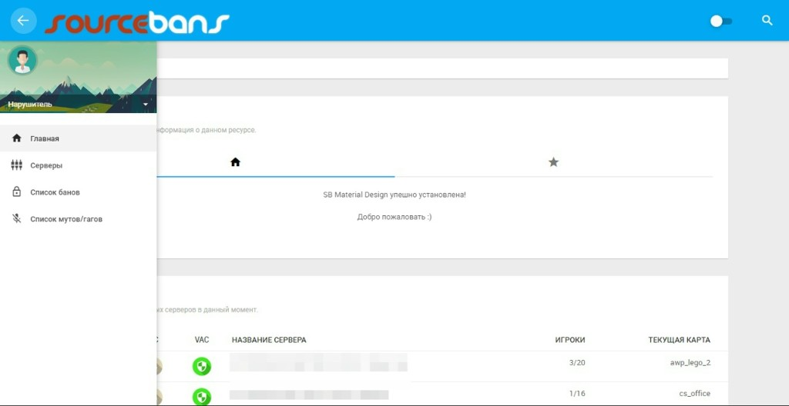

# Blue Material Admin | SourceBans 2.0.6

Веб-панель от **Крузяры** ([lapplandbro](https://github.com/lapplandbro)) для игровых серверов Source (**CS:GO / CS2**, **TF2** и др.) на базе **SourceBans++** с темой **Blue Admin** собственной разработки.


> Target PHP **7.1.33** (на PHP 8.x не рассчитана).

**Topics:** `sourcebans` `sourcemod` `csgo` `cs2` `tf2` `php` `moderation` `material-admin`

---

## Живые примеры

- [SIBNET-SOFTWARE](https://sibnet-software.ru/) — Team Fortress 2  
- [OMSKPUB](https://omskpub.ru/) — Team Fortress 2  

Панель постоянно допиливается — смотрите обновления в этом репозитории.

---

## Что внутри

- Банлист, муты/гаги, админлист, онлайн серверов  
- Веб-RCON, кик и бан из мониторинга игроков  
- Админы, группы, серверные флаги SourceMod, overrides  
- Протесты и предложения банов, кастомные причины  
- Уведомления, системный лог, SMTP  
- SEO: `sitemap.xml`, `robots.txt`, Open Graph-обложка  
- Антифрод LinkedAccounts (PARSEC API)  
- Ваучеры: HEX-ключи, активация только гостем, API для магазина/бота  
- Встроенный установщик с проверкой требований  

**Важно:** сменить «вёрстку / тему / фон» из настроек панели **нельзя** — опции удалены специально. Иначе ловятся серьёзные ошибки (проверено). Тема одна: Blue Admin (`themes/new_box`).

---

## Чем отличается от обычной SB Material

Обычная светлая Material-панель (для сравнения):



Blue Material Admin — тёмный Firewatch-стиль, свой логотип/иконки, вычищенный мусор темы и куча фиксов логики и безопасности поверх SourceBans++ / Material.

Ниже — что реально сделано относительно «стоковой» панели.

### Безопасность

- CSRF-токены на state-changing xajax-запросах  
- Пароли: **bcrypt** (`password_hash`), миграция со старого sha1  
- Сессии: HttpOnly / Secure / SameSite=Lax, regenerate после логина  
- Security-заголовки: X-Frame-Options, nosniff, Referrer-Policy, CSP (с оговоркой под legacy JS)  
- `.htaccess`: без листинга каталогов; закрыты `includes/`, `data/`, `themes_c/`, `config.php`, дампы/бэкапы/`.tpl`  
- Демки не скачиваются напрямую — только через `getdemo.php`  
- RCON с проверкой прав и привязки к серверу; веб-OWNER не ломает доступ  
- Проверки прав `ADMIN_*` на админ-страницах и callbacks  

**Антиабуз «проволока» (tripwire):**

- Нельзя забанить админа панели по SteamID — бан отменяется, права атакующего отзываются  
- То же при попытке бана / удаления / смены прав / варна защищённых SteamID (`SB_PROTECTED_STEAMIDS` в `config.php`)  
- Попытка бана вышестоящего по иммунитету — тоже отзыв прав  
- В системный лог пишется «Превышение полномочий»  

**Закрыто по журналу правок:**

- Password reset poisoning — ссылка сброса больше не строится из подделываемого `Host`  
- RCON command injection через `Host`  
- Обход прав / IDOR (`AddWarning`, `EditAdminPerms`, `SendRcon`, `SetupEditServer` и др.)  
- RCON по уже использованному / просроченному ваучеру  
- Удалён debug-скрипт ADOdb с произвольным SQL  
- RCE через загрузку файлов (Content-Type, двойные расширения, traversal)  
- Патчи SQLi в админке, поиске, статистике, платежном модуле  
- Хранимый XSS через имя сервера (A2S HostName) и ряд XSS/CSRF в банлисте/мутах/футере  
- `hash_equals()` вместо небезопасного сравнения паролей  
- CRLF-инъекция в `EMail()`; письма на доверенный домен из конфига, не `HTTP_HOST`  
- Расширено журналирование: вход/выход, настройки, ваучеры, серверы, моды, меню, правки банов/блоков  
- Пароль в логах скрыт  

### Исправления UX / логики

- Список серверов больше не путает клики и артефакты между строками  
- Убрана бесполезная проверка обновлений в админке («Последний релиз: Ошибка»), которая могла мешать сайту  
- Починена загрузка/обновление GeoIP; кеш флагов стран в банлисте  
- Превью карт: локальные файлы + подгрузка с GameTracker (с fallback)  
- Меню: нормальный выбор иконки и категории по-русски, без идиотизма с FAQ Material UI  
- Синхронизация мутов/гагов (kickit/blockit) — поправлена  
- Бан групп / друзей — починен где возможно (окно групп встроено в бан; друзья — по ситуации)  
- Сообщения через **ShowBox**, а не `alert()` браузера (кроме совсем критичных сбоев)  
- RCON-пароль больше не «забывается» панелью при странных условиях  
- Страницы ошибок 404/5xx + правки `.htaccess`  
- Орфография и тексты (в т.ч. куча косяков в `sourcebans.js`)  
- Нормальные SVG-иконки игр (TF2 — ок; остальные — бейджи по моде)  

---

## Требования

См. [`requirements.txt`](requirements.txt).

| | Минимум | Рекомендуется |
|---|---|---|
| PHP | 7.1 | **7.1.33** (на 8.x не рассчитана) |
| MySQL / MariaDB | 5.0 | 5.5+ / 10.x |
| Расширения | mysqli, bcmath, xml, json, mbstring, openssl, curl | gd, gmp |

Нужны права на запись: `demos/`, `themes_c/`, `data/`, `config.php` (или корень сайта).

## Установка

1. Залей файлы в document root веб-сервера  
2. Создай пустую БД MySQL/MariaDB  
3. Открой `/install/` и пройди мастер  
4. Удали `install/` (кнопка на финише)  
5. При необходимости пропиши `STEAMAPIKEY` и при желании `SB_PROTECTED_STEAMIDS` в `config.php`

Проверка без браузера:

```bash
php install/dry_run.php
```

## Ваучеры

Система выдачи админки по одноразовому ключу. Включается в **Настройки → Ваучеры**. Выпускает ключи только **OWNER** (админка → плитка «Ваучеры»). Активирует ключ **только гость** (не залогиненный): меню «Активировать ваучер» или `index.php?p=pay`.

### Как пользоваться (вручную)

1. OWNER открывает **Ваучеры → Добавить**, жмёт «Сгенерировать», задаёт срок (дни; `0` = навсегда), веб-/серверную группу и серверы.  
2. Ключ отдаёте покупателю / новому админу.  
3. Он заходит **без авторизации** → вводит ключ + капчу → заполняет логин, пароль, SteamID, e-mail → «Активировать».  
4. Создаётся аккаунт админа; ключ становится «Использованный».

**Формат ключа:** криптостойкий HEX — 16 байт → **32 символа** (`a1b2-c3d4-…`). Можно с дефисами. Старые «16 цифр» из прошлых сборок **не активируются** — перевыпустите.

**Важно:** залогиненный админ активировать ваучер не может (создаётся новый аккаунт, путаница с уже существующим). Нужен выход / инкогнито.

### Безопасность активации

- Капча + CSRF на форме  
- После проверки ключа — **session-lock**: нельзя скипнуть капчу прямым вызовом xajax  
- SQL по коду — prepared statements  
- RCON rehash после активации — только по короткому токену в сессии  

### API (магазин / бот)

Эндпоинт `api/voucher_create.php` — автовыпуск HEX-ключа после оплаты. По умолчанию **выключен**.

В `config.php`:

```php
define('SB_VOUCHER_API_TOKEN', 'длинная_случайная_строка_32plus');
define('SB_VOUCHER_API_ALLOW_IPS', ''); // опционально: whitelist IP
```

`POST` JSON: `days`, `group_web` (имя группы как в панели или `"0"`), опционально `group_srv`, `servers`.  
Токен — в теле `token`, `Authorization: Bearer …` или `X-SB-Voucher-Token`.

Тестер: админка → Ваучеры → «Тестер API», либо `php api/voucher_test.php`.  
Справка и пример `curl` — там же в разделе ваучеров.

## Обновление файлов (без updater)

Встроенный updater **не нужен** и часто ломает голову. Обновляй вручную по FTP/SFTP/файловому менеджеру.

### 1. Бэкап

- `config.php`  
- `data/` (если есть)  
- `demos/`, свои `images/maps/`, кастомные картинки  
- дамп MySQL  

Без бэкапа претензии «ничего не работает» не принимаются.

### 2. Скачай сборку

ZIP с ветки `main`: https://github.com/LapplandBro/blue-material-admin  

Распакуй **локально**, не сразу поверх живого сайта.

### 3. Что НЕ затирать

| Путь | Почему |
|---|---|
| `config.php` | ключи, БД, Steam API |
| `data/` | доступы к БД |
| `demos/` | демозаписи |
| `themes_c/` | кеш Smarty (можно очистить) |
| `images/maps/`, свои лого/og-cover | кастом |
| `install/` | на проде папки быть не должно |

Не заливай `install/` на прод и не гоняй установщик поверх рабочей БД.

### 4. Что заливать поверх

С заменой: `includes/`, `pages/`, `scripts/`, `themes/new_box/`, `images/icons/`, `errors/`, корневые `*.php` **кроме** `config.php`.  
`.htaccess` — только если не правил сам.

### 5. После заливки

1. Очисти файлы в `themes_c/` (папку оставь)  
2. Ctrl+F5 в браузере  
3. Проверь главную / банлист / админку  
4. Белый экран / 500 → лог PHP и не затёр ли `config.php`

Обычное обновление файлов **не требует** SQL. Миграции — только если явно написано в релизе.

Целевая PHP: **7.1.33**. На PHP 8.x панель не рассчитана — это не «баг обновления».

---

## Стек

- PHP + MySQL (ADOdb)  
- Тема Blue Admin / Material (`themes/new_box`)  
- SourceBans++ 2.0.x  

## Лицензия

SourceBans / SourceBans++ — **GNU GPL v3**.  
Форк сохраняет ту же лицензию. Копирайты upstream при распространении не выкидывай.

## Credits

- [SourceBans++](https://sbpp.github.io/) / GameConnect SourceBans  
- Material Admin (база темы) → доработка **Blue Admin**  
- [lapplandbro](https://github.com/lapplandbro) / Крузяра — развитие и сборка  
